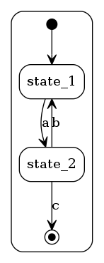
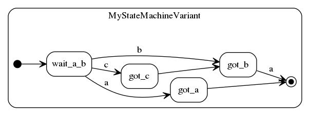
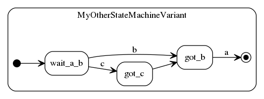
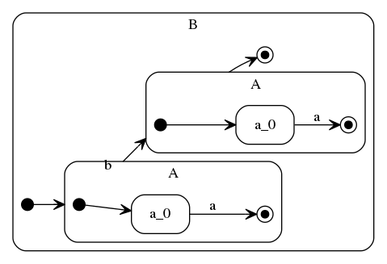

ToySM is a small pure Python implementation of [UML2-like] [1] statemachine
semantics .

List of features supported in ToySM
-----------------------------------
* UML2 features:
  - Hierarchical states
  - enter/exit/do activities
  - Orthogonal regions (ParallelStates)
  - Transitions and Compound Transitions
  - Pseudostates
  	- InitialStates
	- FinalStates
	- TerminateStates
	- Junction
	- Shallow and Deep History states
  - Timeouts (akin to TimeEvents)

* Graphic representation

* Simple syntax to assemble States and Transition into a StateMachine

* Inheritance & Composition semantics to have a building-block approach to state machines.

* Compatible with Python2 and Python3

* Integration with [Scapy] [2]
  - PacketTransition to use Scapy packets as transition
    trigger events.
  - SMBox for use with Scapy Pipes (requires Scapy 2.2.0-dev)

What's still missing
--------------------
* UML2
  - Choice PseudoState
  - Representation of Exit/Enter PseudoStates
  - Fork and Join PseudoStates
  - Event deferral

* Better graphing for Hierarchical states

* Possibility to restart a StateMachine after it has terminated.

* StateMachine Pause function

* Documentation :-)

Dependencies
------------
- [Graphviz] [3]: to produce visual representations of StateMachines
- [xdot] [4]: direct graph rendering instead of rendering to file
- [six] [5]: Python 2/3 compatibility

[1]: http://www.omg.org/spec/UML/2.4.1/Superstructure/PDF "UML2"
[2]: http://www.secdev.org/projects/scapy/ "Scapy"
[3]: http://graphviz.org/ "Graphviz"
[4]: http://github.com/jrfonseca/xdot.py "xdot"
[5]: http://pythonhosted.org/six/ "six"

(Beginnings of a) Tutorial
-------------------------
### Introduction
First things first, there's a good description of what a StateMachine
is supposed to be over at  [Wikipedia]. What ToySM allows you to achieve
is to give a fairly
concise description of a StateMachine and have it run for you based
on inputs you *post* to the StateMachine.

#### A basic StateMachine
The following bit of code gives an example of a very simple StateMachine
that we'll use to walk through some of ToySM's features.

    from __future__ import print_function # python2 compat
    from toysm import State, FinalState, EqualsTransition, StateMachine

    # Section 1 - Declare the States we'll need
    state_1 = State('state_1')
    state_2 = State('state_2')
    final = FinalState()
    
    # Section 2 - Connect the states using Transitions
    state_1 >> 'a' >> state_2
    state_2 >> 'b' >> state_1
    state_2 >> EqualsTransition('c', action=lambda sm,e: print('done')) >> final
    
    # Section 3 - We have our states, create the StateMachine and start it
    sm = StateMachine(state_1, state_2, final)
    sm.start()
    
    # Section 4 - Our StateMachine is ready to process inbound input events
    sm.post('a')	# This will transition the StateMachine from state_1
	    		# to state_2
    sm.post('a', 'b', 'a')	# and around we go...
    sm.post('c')	# we're done.

So let's have a look at what's going on here.
In section 1, we declare the states we are going to need in our future
StateMachine. Furthermore we gave (some) States a name. Naming states can come
in handy when:
- trying to debug a StateMachine, something we'll look at later, and
- identifying the state when we graph the StateMachine.

We also declared a FinalState, these are used to indicate that some
part of the StateMachine has completed. In our very simple case, it
will be used to tell the StateMachine that we've reached the end of our
processing.

Section 2 connects our states together with Transitions. They
describe what Events will cause our StateMachine to change from one
State to another. Here's a more visual version of what we've just
programatically described:

State_1 and State_2 are connected with "EqualsTransitions", as the
name implies this type of Transition checks if the incoming event
is Equal to the value declared when the Transition was initialized.
In case of a match the Transition if followed.

The "state_1 >> 'a' >> state_2" notation is a convenient shorthand for 
"state_1 >> EqualsTransition('a') >> state_2".

You may have noticed that something slightly different is happening
between state_2 and the FinalState. Here the EqualsTransition is 
created explicitly in order to pass in an "action" argument.
This action is simply a function reference that will be called
whenever the StateMachine follows this Transition.

So what we've accomplished here is to describe a StateMachine
that will follow sequences of 'a' input events followed by
'c' input events. If at any point we get a 'b' event, we go 
back to waiting for an 'a' event before a 'c' eventually allows
us to reach the final state and end the StateMachine.

Section 3 is where the StateMachine object is actually created. To
do this we call the StateMachine constructor and pass in the States
that will be participating in our StateMachine. Once that's done, we're
good to go and can "start" the StateMachine. Behind the scenes this
will create a Thread that will wait for events to be posted to the
StateMachine and make its state evolve accordingly.

In Section 4 we actually get around to 'posting' events to the StateMachine
in order to make its internal state evolve. The first call to *post*
will move the StateMachine to state_2, while the second call will move
the state back to state_1 and back to state_2. This second call actually
demonstrates several aspects. First of all the 'a' event at the begining
of the sequence has no effect since when we're in state_2 there are no
egress transitions matching on an 'a' event. The next event is a 'b',
which will effectively take us back to the initial state. The last
event of the sequence takes us back to where we were after the first
call to *post*. The last call to *post* will cause the StateMachine
to finish. (For now calling *start* again on the StateMachine will not 
start it up properly... it's on the todo list though)

TODO
----
### Hierarchy
### State Expressions
It turns out we already bumped into some of these ealier in this
tutorial. For instance the following is a State expression:

	state_1 >> EqualsTransition('a') >> state_2

We didn't delve into any of the specifics, but these expressions can be real
time savors when describing a state machine. We've already seen
how they allow you to connect states, but it turns out you can
use them directly in State or StateMachine initializers.

	s1 = State('s1')
	s2 = State('s2')
	s3 = State('s3', s1 >> 'a' >> s2)

This will fairly concisely achieve the following: declare 3 states,
two of which are substates of the last, connect the two substates
using and EqualsTransition and declare s1 as the *initial* state
of s3. Not bad eh?

Of course you could just as well have written it this way:

	s3 = State('s3')
	s1 = State('s1', parent=s3, initial=True)
	s2 = State('s2', parent=s3)
	s1 >> 'a' >> s2

State Expressions can also be used when initializing a StateMachine, for
instance:

	sm = StateMachine(s1 >> 'a' >> s2)

### Transitions
#### Guards and Saving context
#### Actions
#### Timeouts
### Graphing
### Debugging
### Parallel States
### Layered StateMachines
### Inheritance and Composition
#### Inheritance
Some times you will find that you want to introduce a variation to an
existing StateMachine and would prefer avoiding a complete redefinition
to reep the usual benefits in avoiding code duplication.

The first step involves defining the defining a subclass of StateMachine:
    
    from toysm import *
    
    class MyStateMachine(StateMachine):
        # States we'll be using. Note for the StateMachine to actually
        # work, there must be at least one attribute in MyStateMachine that
        # designates either a State or a Transition
        wait_a_b = State()
        got_a = State()
        got_b = State()
        final_state = FinalState()
        
        # Transitions between our states
        ## A named transition we'll tinker with
        trans_ba = EqualsTransition('a') 
        
        ## the rest of our transitions
        InitialState() >> wait_a_b
        wait_a_b >> 'a' >> got_a >> final_state
        wait_a_b >> 'b' >> got_b >> trans_ba >> final_state
        
        @on_enter(got_a)
        def a_enter(sm, state):
            print("Hey, state %s was entered!" % state)
        
        @action(trans_ba)
        def ba_action(sm, evt):
            print("Got 'b' event followed by an 'a' event")

Now we can run the StateMachine as seen previously:

    mysm = MyStateMachine()
    mysm.start()
    mysm.post('a', 'b')
    mysm.join(1)    # wait for the StateMachine to exit

This should produce the following output:
    
    Hey, state {State-got_a} was entered!

Note: when a StateMachine is defined as just described (in a StateMachine 
subclass) it is no longer necessary to pass the top-level states into
the StateMachine() constructor.

Similarly, the following sequence of instructions:

    mysm = MyStateMachine()
    mysm.start()
    mysm.post('b', 'a')
    mysm.join(1)

will produce this output:

    Got 'b' event followed by an 'a' event

Now let's introduce a variant of MyStateMachine that also accepts a 'c' event
when in state "wait_a_b". Furthermore we need to update the action message
in "trans_ba".

    class MyStateMachineVariant(MyStateMachine):
        got_c = State()
        MyStateMachine.wait_a_b >> 'c' >> got_c >> MyStateMachine.got_b
        
        @on_exit(got_c)
        def c_exit(sm, state):
            print("Leaving state %s" % state)
        
        @action(MyStateMachine.trans_ba)
        def trans_ba_variant(sm, event):
            MyStateMachine.ba_action(sm, event)
            print("... or maybe 'c' was first followed")
     
    mysm = MyStateMachineVariant()
    mysm.start()
    mysm.post('b', 'a')
    mysm.join(1)

produces the following output:

    Got 'b' event followed by an 'a' event
    ... or maybe 'c' was first followed

and posting a 'c' event first:

    mysm = MyStateMachineVariant()
    mysm.start()
    mysm.post('c', 'a')
    mysm.join(1)

will produce this output:

    Leaving state {State-got_c}
    Got 'b' event followed by an 'a' event
    ... or maybe 'c' was first followed

Now say we would prefer to introduce a variant that does away with
the "got_a" state altogether, one way to do it would be to subclass
MyStateMachineVariant and *mask* "got_a".

    class MyOtherStateMachineVariant(MyStateMachineVariant):
        mask_states('got_a')
     
    mysm = MyOtherStateMachineVariant()
    mysm.start()
    mysm.post('a', 'c', 'a')
    mysm.join(1)

The first 'a' event posted is ignored since MyOtherStateMachineVariant
doesn't have the "got_a" state (or the associated transition from "wait_a_b").
The resulting output is therefore only due to the last two events:

    Leaving state {State-got_c}
    Got 'b' event followed by an 'a' event
    ... or maybe 'c' was first followed

Graphing MyStateMachineVariant and MyOtherStateMachineVariant is an easy
way to show their differences:

    MyStateMachineVariant().graph(dot="rankdir=LR")
    MyOtherStateMachineVariant().graph(dot="rankdir=LR")

It is possible to mask transitions using the same principle by using the
mask_transitions function inside a StateMachine subclass definition.

#### Composition
Now let's assume you don't so much want to create a variant of an existing
StateMachine, but instead want to combine several existing
StateMachines into a single larger one. This is where composition comes in.
Let's start with a simple base StateMachine:

    class A(StateMachine):
        a_0 = State()
        
        @on_enter(a_0)
        def a_enter(sm, state):
            print("Entered %s" % state)
            
        InitialState() >> a_0 >> 'a' >> FinalState()

And compose several copies of A into a larger StateMachine:

    class B(StateMachine):
        # we need at leas one State or Transition attribute:
        i = InitialState()
        i >> A.as_state() >> 'b' >> A.as_state() >> FinalState()

Now if we run the B StateMachine:

    b = B()
    b.start()
    b.post('a', 'b', 'a')
    b.join(1)

we should obtain the following output:

    Entered {State-a_0}
    Entered {State-a_0}

### (Scapy)

[Wikipedia]: http://en.wikipedia.org/wiki/Finite-state_machine
